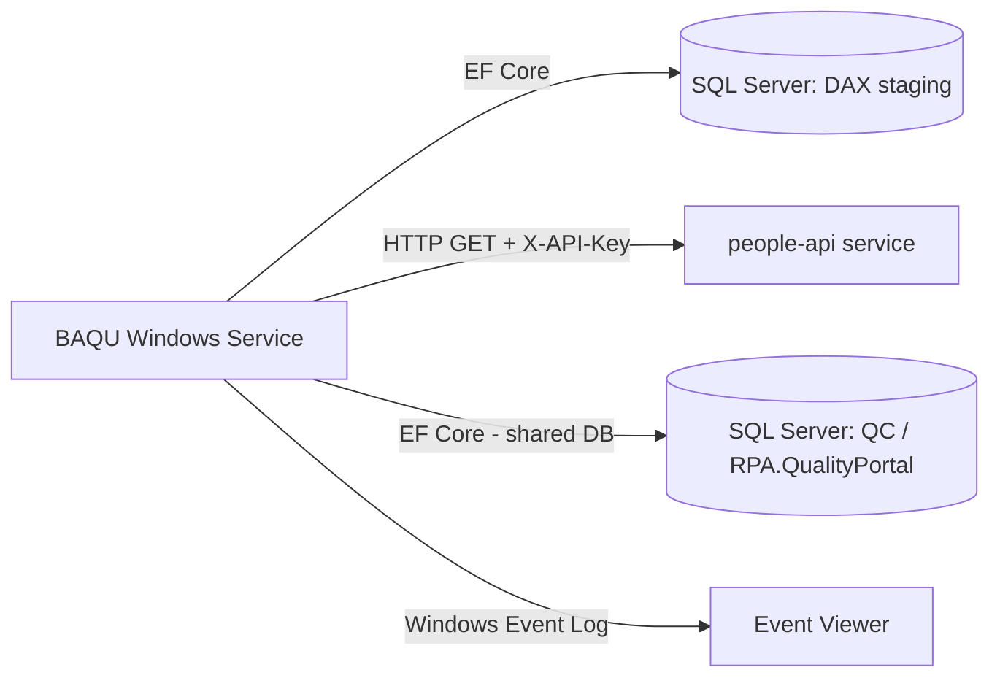

# Assessment - BAQU (Bank Account Quality Update)

## Identification

**Repository Name**: baqu (solution: `BAQU`)
**Type**: Worker / Windows Service (background batch processor)
**Language**: C#
**Frameworks**: .NET 8.0 (`Microsoft.NET.Sdk.Worker`), Entity Framework Core 9.0.2, Microsoft Graph SDK 5.75.0, `Microsoft.Extensions.Hosting.WindowsServices`
**Repository URL**: Local clone only — `baqu/`

## Summary
BAQU ("Bank Account Quality Update") is a modern (.NET 8) Windows Service that reconciles vendor bank account data. It polls a Dynamics AX ("DAX") staging table for updated/expired vendor bank account records (`RSFDwhVendVendorBankAccountStaging`), resolves the person who last modified each record via a People lookup, and writes new Quality Check records directly into the same SQL Server database used by the RPA Quality Portal (`rpa-quality-checks`).

Unlike most of the estate this service already targets modern .NET (net8.0, self-contained single-file publish, EF Core 9), and is packaged to run as a native Windows Service (`BAQUService`) with Windows Event Log logging. It is scheduled (`NCrontab` package + `ExecutionSchedule` config) rather than always-on, and supports a `--force`/`-f` command-line flag for manual/forced execution.

## Service Dependencies

### Cloud Services (GCP/AWS/Azure)
- **Microsoft Graph API** (`Microsoft.Graph` 5.75.0): used indirectly via the `IPeopleRepository` abstraction — likely calls Microsoft Entra ID/Graph for user directory data (mirrors the pattern used by `people-api`)

### Databases
- **DAX** (`ConnectionStrings:DAX`): Dynamics AX staging database — source of vendor bank account change data
- **People** (`ConnectionStrings:People`): a `PeopleContext` EF Core DbContext is also configured/injected into `PeopleRepository`, though the active `Get()` implementation resolves users via the `people-api` HTTP call (see APIs below) rather than direct EF queries — the DbContext may be vestigial/fallback and should be confirmed as live or dead code in Phase 1
- **QC** (`ConnectionStrings:QC`): the RPA Quality Portal's SQL Server database (same schema/DB as `rpa-quality-checks`'s `QualityContext`) — BAQU writes `QualityCheckDetails` rows directly into this shared database, and also maintains a service run log (`ServiceLogService` / `UpdateServiceLog`)

### Messaging
- None found

### Storage
- None found

### APIs and External Integrations
- **people-api** (`PeopleApi:BaseUrl` / `PeopleApi:ApiKey` in `appsettings.json`): **confirmed** — `PeopleRepository.cs` calls `people-api`'s `GET /getusers/by-samaccount/{id}`, `/getusers/by-sid/{id}`, and `/getusers/by-mailnickname/{id}` endpoints over HTTP with an `X-API-Key` header and an `X-State` anti-replay/response-integrity check header. This is a direct, hard dependency: BAQU cannot resolve the "modified-by" person on a bank-account change without `people-api` being reachable.

### Other Dependencies
- `Microsoft.Extensions.Logging.EventLog` — Windows Event Log sink (not portable to Linux containers as-is)
- `NCrontab` — cron-style scheduling parsed from config, executed presumably via a scheduled task/timer rather than an OS-level scheduler

## Communication

### Exposed Endpoints
- None — this is a worker service, not an API

### Consumed Endpoints
| Service | Method | Endpoint | Purpose |
|---------|--------|----------|---------|
| people-api | GET | `/getusers/by-samaccount/{id}`, `/getusers/by-sid/{id}`, `/getusers/by-mailnickname/{id}` | Resolve person details (display name, manager) for a modified-by account, keyed with `X-API-Key` |

### Asynchronous Communication
- None found (this service itself behaves like a scheduled batch/async worker at the OS level, but has no message broker dependency)

### Communication Diagram

## Configuration

### Environment Variables
- None explicit — configuration flows through `appsettings.json` + User Secrets (Development) + `secrets.json` (Production, excluded from single-file publish)

### Configuration Files
- `appsettings.json`: `ConnectionStrings` (`DAX`, `People`, `QC` — all blank placeholders in source), `Options:ExcludeList`/`ExecutionSchedule`, `PeopleApi:BaseUrl`/`ApiKey`, `WindowsService:ServiceName`
- `secrets.json.template`: template for local developer secrets
- `update-permissions.ps1`: PowerShell script, likely grants the service account permissions needed to run as a Windows Service

### Secrets and Sensitive Parameters
- `PeopleApi:ApiKey` — API key for the People API, intended to be supplied via secrets/User Secrets, not committed
- Database connection strings intentionally left blank in source and supplied per-environment

## Infrastructure

### Containerization
- **Dockerfile**: No
- **Base Image**: N/A — project explicitly publishes as a **self-contained, single-file, win-x64** executable (`RuntimeIdentifier=win-x64`, `SelfContained=true`), which is a strong signal it is designed to run as a native Windows Service, not in a Linux container

### Kubernetes/Helm
- **Manifests**: No
- **Helm Charts**: No

### Infrastructure as Code
- **Terraform**: No
- **Bicep/CloudFormation**: No

### CI/CD
- **Pipeline**: None found specific to this app (only the generic scaffolded workflow files from the migration tooling)
- **Files**: N/A

## Testing
- No dedicated test project found alongside `BAQU.csproj` in this repository (unlike most other repos in the estate, which pair a `.Tests` project).

### Observations
Lack of an automated test project is a gap given this service performs financial/vendor bank-account reconciliation logic — recommend adding unit tests before/while modernizing.

## Points of Attention for Multi-Cloud/Azure Migration

### Cloud-Specific Dependencies
- Windows-specific hosting (`UseWindowsService`, `Microsoft.Extensions.Hosting.WindowsServices`, Event Log sink, win-x64 self-contained publish) — needs redesign for Azure (e.g., **Azure Functions Timer Trigger**, **Azure Container Apps Jobs**, or a **WebJob**) to avoid a lift-and-shift onto an IaaS VM
- Direct **shared-database coupling** with `rpa-quality-checks` (writes into the same `QualityContext`/QC database rather than calling an API) — this is an architectural risk for independent service migration/scaling and should be flagged as a decision point (introduce an API boundary vs. keep shared DB access)

### Hardcoded Configurations
- Blank connection strings by design (good practice) but the shared **QC database schema knowledge is duplicated** between BAQU and RPA.QualityPortal — any schema change in one must be coordinated with the other

### Legacy Code or Old Patterns
- None significant — this is one of the more modern/well-structured apps in the estate already on .NET 8

### Specific Recommendations
1. Confirm whether the injected `PeopleContext` EF Core DbContext in `PeopleRepository` is dead/fallback code, since the live path resolves people via the `people-api` HTTP call — remove if unused to simplify the migration surface.
2. Replace Windows Service hosting model with an Azure-native scheduled compute option (Azure Functions Timer Trigger or Container Apps Jobs) given the `NCrontab`-driven schedule already suggests periodic execution.
3. Replace direct writes into the shared `QC`/`QualityContext` database with a call to a `rpa-quality-checks` API endpoint (introduce a service boundary) to decouple these two apps' database schemas during migration.
4. Add missing unit test coverage before refactoring hosting/scheduling logic.
5. Migrate Windows Event Log logging to Azure Monitor/Application Insights structured logging.
6. When `people-api` migrates its `X-API-Key`/`X-State` custom auth scheme to Entra ID/managed identity, BAQU's `PeopleRepository` HTTP client must be updated in lockstep — track as a coordinated cross-repo change.

## Additional Observations
- This is the **most Azure-ready** application in the portfolio from a runtime perspective (.NET 8, EF Core 9), but its **Windows Service hosting model and shared-database coupling to RPA.QualityPortal** are the two biggest architectural blockers to a clean Azure PaaS migration.
